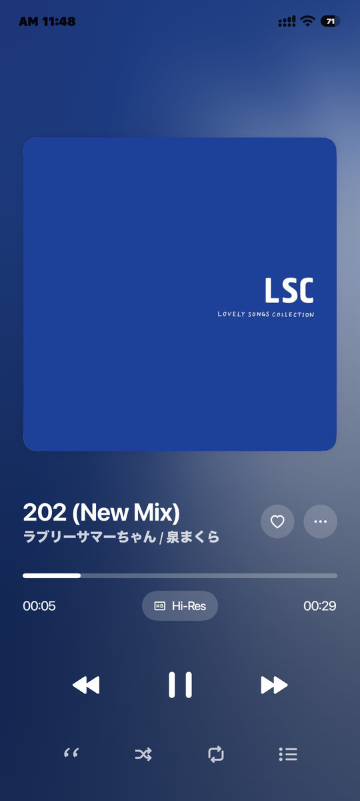
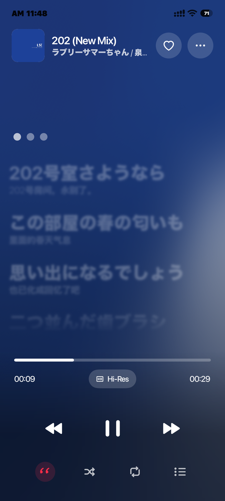
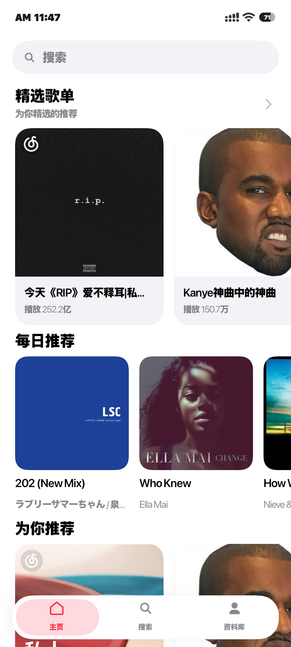
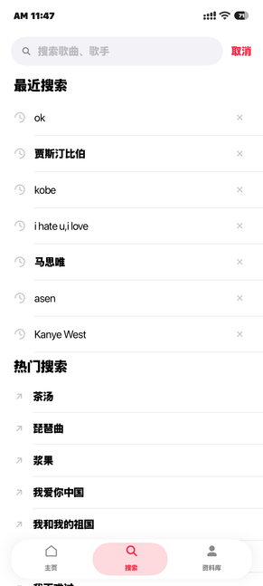
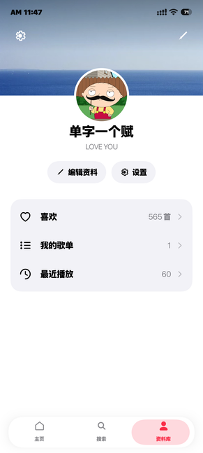

# 云音

一个仿 Apple Music 风格的网易云音乐第三方 Android 播放器。

用 **Kotlin + Jetpack Compose** 从零实现，界面遵循 Apple Human Interface Guidelines，
核心能力是**逐字歌词**与**封面驱动的流动背景**。

[](LICENSE)


> **非官方客户端。** 本项目与网易云音乐、Apple 均无关联，仅供个人学习与技术研究。
> 音乐内容、歌词、商标及相关权利归各自权利人所有。使用前请自行确认符合当地法律与服务条款。
>
> **温馨提示：** 本项目不提供免费听歌功能，收听网易云会员歌曲需自行开通网易云音乐会员。

---

## 目录

- [功能](#功能)
- [截图](#截图)
- [快速开始](#快速开始)
- [技术栈](#技术栈)
- [实现要点](#实现要点)
- [项目结构](#项目结构)
- [测试](#测试)
- [许可证与致谢](#许可证与致谢)
- [免责声明](#免责声明)

---

## 功能

### 播放

- **Apple Music 式播放页** —— 封面驱动的整页背景、可拖拽收起的封面手势、进度条拖拽与逐帧位置插值。
- **逐字歌词** —— 支持 AMLL TTML 与网易云 YRC 两路逐字时间轴，含逐字渐变填充、逐字跳动、
  和声/伴奏分轨、间奏呼吸点、翻译与注音；两路来源自动择优合并并做时间轴对齐。
- **沉浸歌词** —— 静置数秒自动隐藏界面，歌词铺满全屏；横竖屏分别适配，横屏为「左侧控制栏 + 右侧歌词」。
- **音质切换** —— 标准 / 较高 / 极高 / 无损 / Hi-Res 五档，切换后即时重载当前曲目。
- **播放队列** —— 底部 Sheet 展示队列，支持跳转、播放模式（顺序 / 单曲 / 随机）切换。
- **后台播放** —— Media3 ExoPlayer + `MediaSessionService`，支持锁屏与通知控制。

### 浏览

- **首页** —— 推荐歌单、每日推荐、新歌速递、排行榜。
- **搜索** —— 关键词搜索与热门搜索，带搜索历史。
- **歌单详情** —— 封面放大加模糊作为整页色场，正文颜色由封面**亮度测得**（暗封面白字、亮封面深字）；
  顶部返回/分享条常驻并随滚动过渡为不透明；列表标注序号与正在播放行。
- **歌手详情** —— 播放页点歌手名进入；多人合作曲的**每个歌手都可单独点击**。
  圆形头像、姓名与播放/随机操作，列表沿用歌单页的行样式。
- **个人资料** —— 自定义背景图、头像、个性签名与昵称；头像与昵称可分别选择是否跟随网易云账号，
  未登录时显示占位资料。

### 收藏与系统集成

- **本地优先的收藏** —— 爱心直接写入本地列表并与云端收藏合并，未登录或离线也可用。
- **一起听** —— 和另一个人同步听同一首歌：一端创建房间得到房间码，另一端输入即可加入。
  **默认不需要部署任何东西**（走一个公开的发布/订阅服务），也支持自建中继；见下方「一起听」。
- **分享** —— 歌曲与歌单分享文本。
- **词幕（Lyricon）状态栏歌词** —— 可选集成，安装词幕后由它渲染到状态栏／锁屏。
- **Flyme 状态栏歌词** —— 在支持该功能的 Flyme 系 ROM 上把当前歌词显示在状态栏。
- **网页登录** —— 应用内嵌浏览器登录，自动获取登录态，无需手动复制 Cookie。

---

## 截图

| 播放页 | 逐字歌词 | 首页 |
|:--:|:--:|:--:|
|  |  |  |

| 搜索 | 资料库 | |
|:--:|:--:|:--:|
|  |  | |

---

## 快速开始

### 环境要求

| 项 | 要求 |
|---|---|
| JDK | 17 或更高 |
| Android SDK | `compileSdk` 37，含 build-tools 37.0.0 |
| 设备 | Android 13（API 33）及以上 |

项目自带 Gradle Wrapper，无需单独安装 Gradle。

### 配置（两项都在本地，不进仓库）

项目通过两个 **git-ignored** 的配置文件读取本地配置。

**`local.properties`** —— 除 SDK 路径外，增加接口地址：

```properties
api.base.url=https://your-netease-api.example.com
```

该值在编译期注入 `BuildConfig.API_BASE_URL`，**源码中不含任何服务器地址**。
留空时应用能正常构建与启动，只是在调用接口时提示「未配置接口地址」。

**`keystore.properties`** —— 签名（不配置则 release 包不签名，但构建不会失败）：

```properties
storeFile=my-release.jks
storePassword=****
keyAlias=mykey
keyPassword=****
```

生成自己的密钥：

```bash
keytool -genkeypair -v -keystore my-release.jks -alias mykey \
        -keyalg RSA -keysize 2048 -validity 10000
```

### 构建

```bash
./gradlew :app:assembleDebug       # 调试包
./gradlew :app:assembleRelease     # 发布包（未配置签名则不签名）
./gradlew :app:testDebugUnitTest   # 单元测试
```

若环境中 `java` 不在 PATH，设置 `JAVA_HOME` 指向你的 JDK 即可。

### 字体

界面使用 **SF Pro**。因许可限制，该字体**不包含在本仓库**，请自行获取后放入：

```
app/src/main/res/font/sf_pro.ttf
```

或把 `ui/theme/Type.kt` 中的 `SFPro` 换成 Inter / Noto Sans 等可自由分发的字体。

> 仓库中的图标为**手绘矢量**，命名对齐 SF Symbols，未使用 Apple 的任何资产。

---

## 技术栈

| 项 | 版本 / 说明 |
|---|---|
| 语言 | Kotlin 2.4 |
| UI | Jetpack Compose（Compose Multiplatform 构件）1.12 / Material 3 1.9 |
| 播放 | Media3 ExoPlayer + MediaSessionService 1.11 |
| 网络 | OkHttp 4.12 |
| 图像取色 | AndroidX Palette |
| 流动背景 | AGSL（`android.graphics.RuntimeShader`，需 API 33+） |
| 底栏 | [Backdrop](https://github.com/Kyant0/AndroidLiquidGlass)（Apache-2.0） |
| 逐字歌词 | 渲染 [accompanist-lyrics](https://github.com/6xingyv/accompanist-lyrics-ui)（Apache-2.0）＋ 数据 [AMLL TTML DB](https://github.com/amll-dev/amll-ttml-db)（CC0-1.0） |
| 状态栏歌词 | 词幕 Lyricon Provider（Apache-2.0）+ Flyme 通知 ticker |
| 构建 | Gradle 9.7.1 / AGP 9.3.2 |
| minSdk / targetSdk | 33 / 37 |

---

## 实现要点

### 逐字歌词

两路来源，按「有逐字优先」并发竞速合并，统一解析为一种 `SyncedLyrics`：

1. **[AMLL TTML DB](https://github.com/amll-dev/amll-ttml-db)**（首选，与 Apple Music 同源的逐字歌词）
   `ncm-lyrics/{网易云歌曲ID}.ttml`，按网易云 ID 直取，
   含逐音节时间、对唱左右声道与翻译。多镜像（jsDelivr / fastly / gcore / raw / ghproxy）
   并发竞速，取第一个可用结果。该库的歌词数据以 **CC0-1.0** 公有领域贡献。
2. **网易云 `/lyric/new`**：`yrc`（逐字）优先，否则 `lrc`（逐行）；
   翻译优先取 `ytlrc`（对齐逐字），其次 `tlyric`（对齐逐行）。

两路来源若时间轴不一致（同一首歌的 Apple Music 版本前奏更短），
会以网易首行时间为准做整体平移对齐。

播放位置以**每帧插值**提供，而非低频轮询——否则逐字时间轴会抖。

### 流动背景

不是模糊。组成：

1. **封面取色** —— AndroidX Palette 取 5 个角色色并做 HSL 柔化。
2. **色场** —— AGSL 着色器把五个柔和色场按反平方权重混合；
   色场被映射到一条色带再拉伸，这是斜向大色带的来源（铺满全屏只会得到一片柔糊）。
3. **流动** —— 色场中心随时间做轨道运动，另由音频响应的 beat/motion 波位移采样坐标。
4. **音频响应** —— 从 ExoPlayer 音频管线 `TeeAudioProcessor` 取 PCM，
   经 RMS → 快/慢 EMA → 自适应噪声底 → 节拍检测，再非对称平滑后驱动 uniforms。

底栏由**同一份背景场**渲染两层实现：一层模糊、一层清晰，
清晰层在面板边界渐隐——两层颜色逐像素一致，交界处只改变锐度，因此不会出现色阶。

### 播放

`Media3 ExoPlayer` + `MediaSessionService`（后台播放、锁屏与通知控制）。

网易云返回的是**短时效签名 URL**，因此队列项用 `netease://track/{id}` 占位，
由 `ResolvingDataSource` 在真正加载时才换真链——队列因此保持稳定，
ExoPlayer 可正常处理切歌与重试。

会员曲（`fee=1`）在免费会话下只返回 45 秒试听片段，应用会识别并提示，
同时避免把片段当作完整歌曲循环。

### 状态栏歌词

**词幕（Lyricon）**：接入其官方 Provider 接口对应用完全可选，未安装词幕时整个功能是空操作，
应用其余部分不受影响；设置页显示当前连接状态并可重试。
（[词幕 Lyricon](https://github.com/tomakino/lyricon)，Apache-2.0）

**Flyme**：Flyme 的状态栏歌词是**系统功能**，它改造了 Android 通知的 ticker。
应用按 Flyme 官方适配说明发一条常驻通知：歌词放在 `setTicker(...)`，
并设置其私有的 `FLAG_ALWAYS_SHOW_TICKER` 与 `FLAG_ONLY_UPDATE_TICKER`。
这两个 flag 只存在于移植了该功能的 ROM 上，大多数机型都不支持，
此时不创建任何通知，设置页也直接说明「当前系统未内置该功能」。

### 一起听

**为什么网易的接口用不了。** 网易自己的一起听走的是 **Agora RTC 频道**（房间信息里带
`agoraChannelId`），它的 HTTP 接口对播放状态是**只写不读**的：`sync/list/command`、
`play/command`、`heartbeat` 都返回成功，但 `sync/playlist/get` 返回空、
`/listentogether/status` 的 `anotherDeviceInfo` 恒为 `null`。这是实测结论，不是推测。
所以第三方客户端要同步，就必须有一条自己的"读"通路。

**默认：不需要部署任何东西。** 缺的只是"读"这一步，而读可以由一个现成的消息中转提供。
默认走 **MQTT**（公共 broker，例如 `broker.hivemq.com`，匿名可用、无需注册）：

- **房间码就是主题前缀**，因此建房是纯本地操作（生成一个码），加入只是订阅同一个前缀。
  没有房间注册表，也没有"房主"这个概念。
- **每个成员有自己的"槽位"**（`yunyin/together/v1/<房间码>/<成员id>`），所以两人的状态
  互不覆盖；成员订阅房间通配符 `…/<房间码>/+` 收所有人的状态。
- **发布用"保留消息"（retained）**：broker 会为每个主题保留最后一条，所以**中途加入的人
  立刻就能看到对方当前的歌曲与进度**，不用等下一次心跳。这也是为什么槽位必须按成员分开——
  共用一个主题的话，两人的状态会互相覆盖。
- **离开会清空自己的槽位**（发一条空的保留消息）。否则一台退出的设备会一直"看起来还在"——
  保留消息的生命周期比它的发布者长。
- **一条长连接、服务端主动推送**：不像 HTTP 那样每个动作都要一次请求，**接收不消耗配额**，
  对方的操作瞬间到达。心跳只用于承载缓慢漂移的进度与存活证明，20 秒一次。
- **订阅必须等确认，没确认就重发。** 公共 broker 会**间歇性**接受 SUBSCRIBE 却不回 SUBACK
  （实测：6 个全新订阅里有 1 个需要 9 次尝试、约 7 秒才被确认）。此时客户端看起来连接正常、
  还在发布，但**收不到任何消息**——表现为"房间里只有我一个人"。所以客户端跟踪每个订阅的确认，
  未确认就重发，并且**必须等到确认之后**才开始发布。
- 判活按"我多久没听到他"计算（本机时钟），因此**两端时钟不需要一致**
  （装在兜里的手机，时钟从来不一致）。
- **房间码是 12 位**，用不含 `0/O`、`1/I/L` 的字母表（要口述和手输，这几个最容易抄错），
  显示时按 4 位分组。
- **主题是公开的**：知道房间码的人就能读到这些消息。传输的只有歌曲 id、进度、播放状态和昵称，
  **没有账号、没有 cookie、没有歌名**——但房间码因此要当成口令，不要到处发。
  12 位随机码不可猜，设计的用法是发给某一个具体的人。
- **为什么不用 HTTP 中转**：早期版本走的是一个免费 HTTP 发布/订阅服务，但它的免费额度是
  **按来源地址计算、而且是共享的**——同一个网络出口（家里/公司同一个 NAT）下所有设备共用一份，
  真实使用中直接撞上限流（App 里表现为 **HTTP 429 / 服务限流**）。MQTT 没有这个形状。
  那条路仍然保留，配置 `together.ntfy.url` 即可启用。

**可选：自己搭中继。** `server/together-relay.js` 是一个**零依赖**的 Node 服务（只用内置模块，
约 250 行，读一遍就能审计完），适合不想依赖第三方的情况。配置了 `together.base.url` 就会
自动改用它，客户端的其余部分一行不改：

```bash
cd server && chmod +x deploy.sh && ./deploy.sh    # Linux（含宝塔面板）
```

Windows 服务器用 `server\deploy.bat`。脚本会检查 Node、**生成随机访问令牌**写入
`together.env`（权限 600）、用 pm2 或 nohup 拉起、自检 `/health`，并打印你要填的配置。

**关于令牌。** 中继若暴露在公网，**务必带令牌**：设了 `RELAY_TOKEN` 后，除 `/health` 外
所有请求都必须带 `X-Relay-Token`，否则 401（常量时间比较）。令牌由部署脚本随机生成；
`server/together.env` 已被 `.gitignore` 排除——它属于那台机器的本地配置，不是源码。

自测：`node server/test_mqtt.js`（MQTT 报文：连接/订阅/发布/保留）、
`node server/test_mqtt_room.js`（房间布局：每人独立槽位、通配订阅、离开清槽）、
`node server/test_relay.js`（自建中继的房间生命周期）、`node server/test_token.js`（中继令牌）、
`node server/test_ntfy.js`（可选 HTTP 通道的协议）。

**只有一台设备怎么测。** 用 `server/host_room_mqtt.js` 在电脑上扮演"对方"：先在 App 里创建房间，
把这个脚本指向那个房间码，手机就会跟随脚本发布的歌曲与进度。

```bash
node server/host_room_mqtt.js <房间码> [歌曲id] [起始毫秒] [playing]
# 例：node server/host_room_mqtt.js ABCD2345WXYZ 1330348068 20000 true
#     （1330348068 = 起风了，免费曲；VIP 曲只有 45 秒试听，会干扰观察）
```

它和 App 走的是同一套协议，已经用 `server/test_mqtt_room.js` 验证过。
注意这里**成员身份按设备划分**（每台安装各有一个随机 id），而不是按账号——
所以同一个账号在两台设备上也能正常互见，这也正是单账号可测的前提。

要用**只读**方式看一个房间里目前在传什么（排查时最有用，不会打扰房间）：

```bash
node server/read_room.js <房间码> 15      # 订阅 15 秒并打印每个成员的槽位
```

因为发布是保留的，它一订阅就能立刻看到房间里**当前**的状态（不需要等谁发下一次心跳），
并会标注每条状态是多久之前上报的，避免把旧数据误读成实时。

排查时请用**免费歌曲**（`fee=0` 或 `8`）测试：VIP 曲（`fee=1`）在免登录会话下只返回
45 秒试听，播放到片尾会被试听逻辑重新拉起，看起来像"同步在抖动"，其实是试听的既有行为。

配置（全部可选，都在 `local.properties`，与接口地址同样不进仓库）：

```properties
# 自建中继（优先级最高）：填了就改用它，不用任何第三方
together.base.url=http://your-relay-host:8090
together.token=部署脚本打印的令牌
# 换一个 MQTT broker（默认 broker.hivemq.com:1883，可指向自建 broker）
together.mqtt.host=
together.mqtt.port=
# 启用可选的 HTTP 发布/订阅通道（填了会优先于 MQTT）
together.ntfy.url=
```

**同步怎么避免两边互相纠正。** 这是这类功能最容易做坏的地方：A 纠正、B 跟着纠正回来，
音乐就会不停抖动。这里的规则放在纯函数 `TogetherSync` 里并单独测试：
偏差小于 2 秒不动（这种偏差听不出来，但频繁微调很刺耳），
每次纠正后 6 秒内不再接受新的纠正（让状态先稳定下来），
**换歌**无条件立即跟随。另外**谁最后操作谁说了算**（用逻辑时钟比较，不依赖两端时钟），
否则你按下一首会立刻被对方的旧状态拉回来。18 项单测覆盖这些边界。

---

## 项目结构

```
app/src/main/java/com/yunyin/music/
├── MainActivity.kt      单 Activity，手写状态机式导航
├── core/                模型与工具
│   └── player/effects/  音频响应（RMS / 节拍检测）
├── data/                接口、解析、缓存、本地存储
│   ├── net/             NeteaseClient（所有 HTTP 调用）
│   └── together/        一起听：传输层 + 同步规则
├── lyrics/              逐字歌词渲染器（vendored）
├── playback/            ExoPlayer 封装、数据源解析、音频管线
└── ui/                  Compose 界面
    ├── background/      流动背景（AGSL + Palette）
    ├── components/      通用组件（卡片、玻璃、队列、过渡）
    ├── icons/           手绘矢量图标
    ├── screens/         各页面
    └── theme/           颜色、字体、形状

server/                  一起听（可选的自建中继 + 协议端到端测试）
```

---

## 测试

```bash
./gradlew :app:testDebugUnitTest
```

单元测试覆盖歌词解析与对齐、渲染折叠、逐字滚动的纯逻辑、位置插值、收藏合并规则、
异步结果竞态、一起听的同步判定与防抖、房间码与主题映射、房间状态的两类清理等，共 **192 项**。

`server/` 下另有几个端到端测试，都模拟两个成员跑完整流程（都会真的连公共 broker/服务）：

```bash
node server/test_mqtt.js              # MQTT 报文：连接 / 订阅 / 发布 / 保留消息
node server/test_mqtt_room.js         # 房间布局：每人独立槽位、通配订阅、离开清槽
node server/test_mqtt_connect_wait.js # 连接是异步的：必须在连接就绪后再发布
node server/test_mqtt_subscribe_retry.js # 订阅确认会丢：未确认必须重发
node server/test_relay.js             # 自建中继的房间生命周期
node server/test_token.js             # 中继的访问令牌
node server/test_ntfy.js              # 可选 HTTP 通道的协议
```

---

## 许可证与致谢

### 代码来源

| 部分 | 来源 | 许可证 |
|---|---|---|
| 流动背景（着色器、painter、调色板、音频响应） | [NeriPlayer](https://github.com/cwuom/NeriPlayer) | **GPL-3.0** |
| 逐字歌词渲染器（`lyrics/`，vendored） | [accompanist-lyrics-ui](https://github.com/6xingyv/accompanist-lyrics-ui) | Apache-2.0 |
| 逐字歌词解析（`lyrics-core` 依赖） | [accompanist-lyrics-core](https://github.com/6xingyv/accompanist-lyrics-core) | Apache-2.0 |
| 逐字歌词数据（运行时获取，不随仓库分发） | [AMLL TTML DB](https://github.com/amll-dev/amll-ttml-db) | **CC0-1.0** |
| 词幕接入（`LyriconBridge` / `LyriconMapper`） | 本项目代码，依赖 [词幕 Lyricon](https://github.com/tomakino/lyricon) 的 Provider 接口 | Apache-2.0 |
| 底栏 | [AndroidLiquidGlass](https://github.com/Kyant0/AndroidLiquidGlass) | Apache-2.0 |
| 音质图标 | Google Material Symbols | Apache-2.0 |
| 其余界面 / 数据 / 网络 / 播放 | 本项目 | 见下 |

### 许可证

由于流动背景与音频响应源自 **GPL-3.0** 的 NeriPlayer，
按 GPL-3.0 的分发条款，**整个组合作品需以 GPL-3.0 分发**。
本仓库因此以 **GPL-3.0** 发布，全文见 [LICENSE](LICENSE)。

若希望改用 MIT / Apache-2.0 等宽松许可，需先将上述 GPL 来源的部分
**独立重写**（而非修改注释）。

### 第三方

- **SF Pro** —— Apple 的字体，**不包含在本仓库**，请自行获取或替换（见「字体」）。
- **SF Symbols 同款图标** —— 项目内为手绘矢量，命名对齐 SF Symbols，未使用 Apple 资产。
- **NeteaseCloudMusicApi** —— 服务端由使用者自行部署。

---

## 免责声明

本项目为个人学习与技术研究项目，**非网易云音乐或 Apple 官方客户端**，
与二者无任何关联。「网易云音乐」「Apple Music」「SF Pro」等名称与商标
归各自权利人所有。

**温馨提示：** 本项目不提供免费听歌功能，收听网易云会员歌曲需自行开通网易云音乐会员。

请勿将本项目用于商业用途。使用者需自行承担因使用本软件产生的一切责任。
